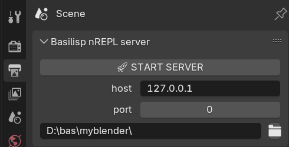
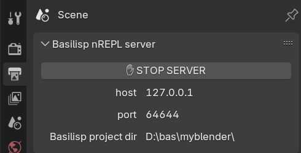
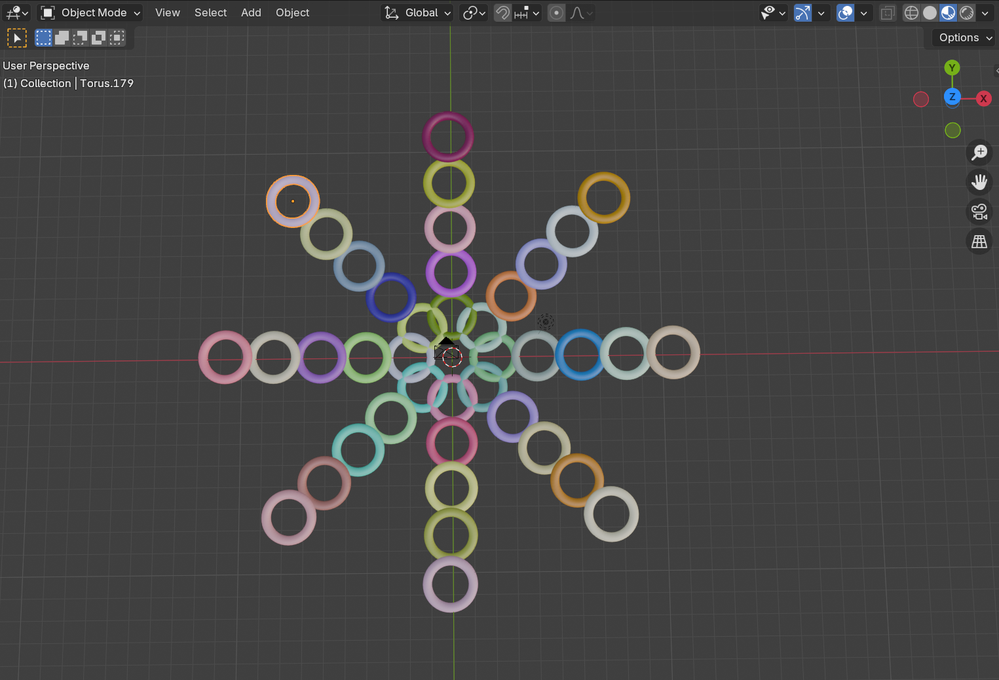
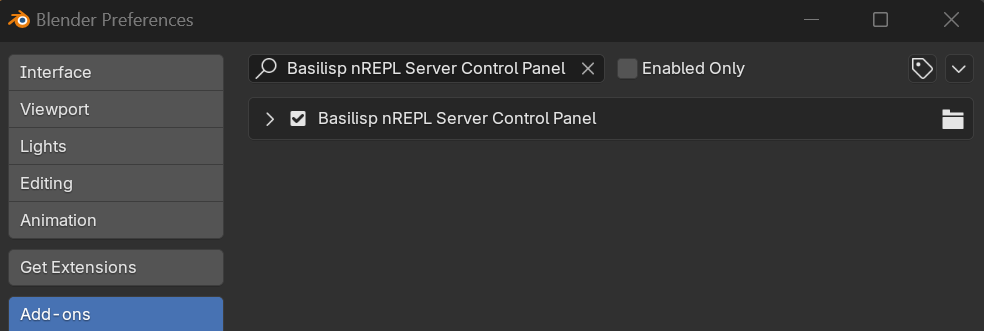

[](https://pypi.org/project/basilisp-blender/) [](https://github.com/ikappaki/basilisp-blender/actions/workflows/tests-run.yml)

# Basilisp Blender Integration

[Basilisp](https://github.com/basilisp-lang/basilisp) is a Python-based Lisp implementation that offers broad compatibility with Clojure. For more details, refer to the [documentation](https://basilisp.readthedocs.io/en/latest/index.html).

## Overview
`basilisp-blender` is a Python library designed to facilitate the execution of Basilisp Clojure code within [Blender](https://www.blender.org/) and manage an nREPL server for interactive programming from within your editor of choice. 
This library provides functions to evaluate Basilisp code from Blender's Python console, file or Text Editor and to start an nREPL server, allowing seamless integration and communication with Basilisp.

## Installation

For Blender `>= 4.2.0`, download the `basilisp_blender_extension-<version>.zip` extension file from the [releases](https://github.com/ikappaki/basilisp-blender/releases) page.
Install in Blender by navigating to:

`Edit > Preferences > Get Extensions > Install From Disk...`

Then, enable it by ticking the checkbox under:

`Edit > Preferences > Add-ons > ☐ Basilisp Blender Extension`

Alternatively, you can also install and enable the extension (`-e`) via the command line:

```shell
$ blender --command extension install-file basilisp_blender_extension-<version>.zip -r user_default -e
```

After installation, the extension will appear as activated under the `Get Extensions` tab in Preferences.

For Blender versions `< 4.2.0`, refer to  [Manual Installation and Setup](#Manual-Installation-and-Setup).

## Usage

### Basilisp Interface

Refer to the `basilisp-blender` [API.md](API.md), and the [Blender API](https://docs.blender.org/api/current/index.html) for  for details on [interoperability with Python](https://basilisp.readthedocs.io/en/latest/pyinterop.html).

### nREPL Server Control Panel

The library includes an nREPL server control panel accessible in Blender’s Properties editor, under the Output panel (icon resembling a printer). From here, users can:
- Start and stop the server.
- Configure the local interface address and port.
- Specify an optional `Basilisp Project Directory`.





The `Basilisp Project Directory` is the location where your Basilisp code resides.

When the server starts, this directory is:
- Set as the current working directory for the duration of the nREPL session.
- Added to `sys.path`, allowing Basilisp code files within it to be seamlessly require'd.

Additionaly, the following files will also be created in the directory for convenience if they do not already exist:
- `basilisp.edn`: Marks the directory as a Basilisp Project for code editors.
- `scratch.lpy`:  A Basilisp file for users to experiment with writing code.
- `.nrepl-port`:  The port number where the nREPL server is listening. This will overwrite any existing file.

A minimal Project Directory would include these files:

```
<project root directory>
├── .nrepl-port    (N)
├── basilisp.edn   (B)
├── yourcode.lpy   (1)
```

🄝 Created by the nREPL server upon startup.

🄑 An empty file to indicate to Clojure-enabled editors that this is a Basilisp Project.

① Your Basilisp code.

#### Connecting through your Editor

> [!NOTE]
> While it’s not necessary to open the project in your editor to connect to the nREPL server, doing so simplifies setup. 

Open the `basilisp.edn` file to enable Clojure-specific features in your editor.
Both [Emacs/CIDER](https://docs.cider.mx/cider/platforms/basilisp.html) and [VSCode/Calva](https://calva.io/basilisp/) offer explicit support for Basilisp.
If you are using a different Editor, refer to its documentation for instructions on connecting to a running nREPL server.

#### CIDER (Emacs)

1. Run `M-x cider-connect-clj`
2. Select `localhost`.
3. Select the `<project-dir>:<port number>` option.

#### Calva (VSCode)
1. Press `Ctrl-Alt-P` to open the Command Palette.
2. Select `Calva: Connect to a Running REPL Server, in your project`>`basilisp`.
3. The editor will automatically find the port using `.nrepl-port`.

The Editor should now connect seamlessly to the nREPL server.

### Pythonic Interface

#### Evaluating Basilisp Code

##### From a Code String

```python
from basilisp_blender.eval import eval_str

eval_str("(+ 1 2)")
# => 3
```

##### From a File

```python
from basilisp_blender.eval import eval_file

eval_file("path/to/your/code.lpy")
```

##### From Blender’s Text Editor
To evaluate Basilisp code contained in a Blender text editor block:

```python
from basilisp_blender.eval import eval_editor

# Replace `text_block` with your Blender text block name
eval_editor("<text-block-name>")
```

#### Starting an nREPL Server
To start an nREPL server manually within Blender:

```python
from basilisp_blender.nrepl import server_start

shutdown_fn = server_start(host="127.0.0.1", port=8889)
```

The `host` and `port` arguments are optional.
If not provided, the server will bind to a random local port.
It will also creates an `.nrepl-port` file in the current working directory containing the port number it bound to.

The return value is a function that you can call without arguments to shut down the server.

For a more convenient setup, you can specify to output `.nrepl-port` file to your Basilisp's project's root directory.
This allows some Clojure editor extensions (such as [CIDER](https://docs.cider.mx/cider/index.html) or [Calva](https://calva.io/)) to automatically detect the port when `connect`'ing to the server:

```python
from basilisp_blender.nrepl import server_start

shutdown_fn = server_start(nrepl_port_filepath="<project-root-path>/.nrepl-port")
```

Replace `<project-root-path>` with the path to your project's root directory.

# Examples

Also see the [examples](examples/) directory.

Here is an example of Basilisp code to create a torus pattern using the [bpy](https://docs.blender.org/api/current/index.html) Blender Python library:

```clojure
(ns torus-pattern
  "Creates a torus pattern with randomly colored materials."
  (:import bpy
           math))

(defn clear-mesh-objects []
  (.select-all     bpy.ops/object ** :action "DESELECT")
  (.select-by-type bpy.ops/object ** :type "MESH")
  (.delete         bpy.ops/object))

(clear-mesh-objects)

(defn create-random-material []
  (let [mat  (.new bpy.data/materials ** :name "RandomMaterial")
        _    (set! (.-use-nodes mat) true)
        bsdf (aget (.. mat -node-tree -nodes) "Principled BSDF")]

    (set! (-> bsdf .-inputs (aget "Base Color") .-default-value)
          [(rand) (rand) (rand) 1])
    mat))

(defn create-torus [radius tube-radius location segments]
  (.primitive-torus-add bpy.ops/mesh **
                        :major-radius radius
                        :minor-radius tube-radius
                        :location location
                        :major-segments segments
                        :minor-segments segments)
  (let [material (create-random-material)]
    (-> bpy.context/object .-data .-materials (.append material))))

#_(create-torus 5, 5, [0 0 0] 48)

(defn create-pattern [{:keys [layers-num radius tube-radius]
                       :or {layers-num 2
                            radius 2
                            tube-radius 0.2}}]
  (let [angle-step (/ math/pi 4)]
    (dotimes [i layers-num]
      (let [layer-radius (* radius (inc i))
            objects-num (* 12 (inc i))]
        (dotimes [j objects-num]
          (let [angle (* j angle-step)
                x (* layer-radius (math/cos angle))
                y (* layer-radius (math/sin angle))
                z (* i 0.5)]
            (create-torus (/ radius 2) tube-radius [x y z] 48)))))))

(create-pattern {:layers-num 5})
```



## Manual Installation and Setup

The library and the nREPL control panel can be manually installed to support Blender versions earlier than 4.2.

To install the `basilisp-blender` library, use `pip install` from Python console within the Blender's `Scripting` workspace:

```python
import pip
pip.main(['install', 'basilisp-blender'])
```

Adjust the command as needed for your environment. For instance, use `-U` to upgrade to the latest version or `--user` to install to your user directory. For additional options, refer to [pip options](https://pip.pypa.io/en/stable/cli/pip_install/).

Some Blender distribution use a "managed" Python environment, which restricts package installation to the standard directories. To identify a suitable intsallation path, inspect Blender's Python `sys.path` list:

```python
>>> import sys
>>> sys.path
['/usr/share/blender/scripts/startup', '/usr/share/blender/scripts/modules', '/usr/lib/python312.zip',
 '/usr/lib/python3.12', '/usr/lib/python3.12/lib-dynload', '/usr/local/lib/python3.12/dist-packages',
 '/usr/lib/python3/dist-packages', '/usr/share/blender/scripts/freestyle/modules',
 '/usr/share/blender/scripts/addons/modules', '/home/ikappaki/.config/blender/4.0/scripts/addons/modules',
 '/usr/share/blender/scripts/addons', '/home/ikappaki/.config/blender/4.0/scripts/addons']
```

The most suitable directory is likely `scripts/addons/modules`. In the example provided, this corresponds to `~/.config/blender/4.0/scripts/addons/modules`.

Use this path as a `--target` directory when running `pip install`:

```python
>>> import pip
>>> pip.main(['install', 'basilisp_blender', '--target', '/home/ikappaki/.config/blender/4.0/scripts/addons/modules'])
...
Successfully installed attrs-24.2.0 basilisp-0.2.4 basilisp_blender-0.3.0 immutables-0.21 prompt-toolkit-3.0.48 pyrsistent-0.20.0 typing-extensions-4.12.2 wcwidth-0.2.13
0
```

# Troubleshooting

If you encounter unexplained errors, enable `DEBUG` logging and save the output to a file for inspection. For example:

```python
import logging
from basilisp_blender import log_level_set

log_level_set(logging.DEBUG, filepath="bblender.log")
```

Blender scripting [is not hread safe](https://docs.blender.org/api/current/info_gotcha.html#strange-errors-when-using-the-threading-module). 
As a result, the nREPL server cannot be started into a background thread and still expect calling `bpy` functions to work without corrupting its state.

To work around this limitation, the nREPL server is started in a thread, but client requests are differed into a queue that will be executed later by a `bpy` custom timer function. 
The function is run in the main Blender loop at regular intervals, avoiding parallel operations that could affect Blender's state.

If necessary, you can adjust this interval to better suit your needs by passing the `interval_sec` argument to the `server_start` function:

```python
from basilisp_blender.nrepl import server_start

shutdown_fn = server_start(port=8889, interval_sec=0.05)
```

# Development

This package uses the [Poetry tool](https://python-poetry.org/docs/) for managing development tasks.

## Testing

You can run tests using the following command:

```bash
$ poetry run basilisp test
```
### Integration testing

To run integration tests, set the `$BB_BLENDER_TEST_HOME` environment variable to the root directory of the Blender installation where the development package is installed. See [Installing Blender and the Development Package](Installing-Blender-and-the-Development-Package) on how to facilitate the installation.

```bash
$ export BB_BLENDER_TEST_HOME="~/blender420"
# or on MS-Windows
> $env:BB_BLENDER_TEST_HOME="c:\local\blender420"
```
Then run the integration tests with

```bash
$ poetry run basilisp test --integration -v
```

### Generating the extension

Set the `$BB_BLENDER_TEST_HOME` environment variable to point to your Blender installation directory:


```bash
$ export BB_BLENDER_TEST_HOME="~/blender420"
# or on MS-Windows
> $env:BB_BLENDER_TEST_HOME="c:\local\blender420"
```

Run the script to generate the extension.
Include `--and-install` to install it:

```bash
$ poetry run basilisp run scripts/bb_extension_create.lpy --and-install
```

### Installing Blender and the Development Package

To download and install Blender in the directory specified by `$BB_BLENDER_TEST_HOME`, use:

```bash
$ poetry run python scripts/blender_install.py 4.2.0
```

To install the development version of the package at the same location, use:

```bash
$ poetry build                                    # build the package
$ poetry run python scripts/bb_package_install.py # install it in Blender
```

To enable the control panel, download the latest `nrepl_panel_addon_<version>.py` file from the [releases](https://github.com/ikappaki/basilisp-blender/releases) and install via`Edit`>`Preferences`>`Add-ons`>`Install From Disk`. 

The add-on should appear in list--be sure to check its box to activate it.




# License

This project is licensed under the Eclipse Public License 2.0. See the [LICENSE](LICENSE) file for details.

## Extension License

The extension is licensed under the GNU General Public License v3.0.

See the [LICENSE_EXTENSION](LICENSE_EXTENSION) file for details.
